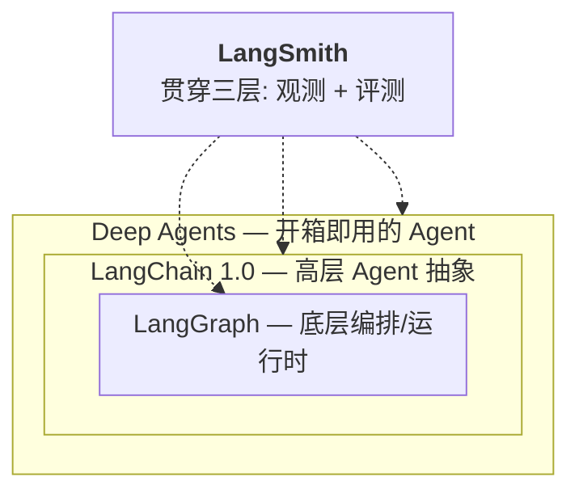
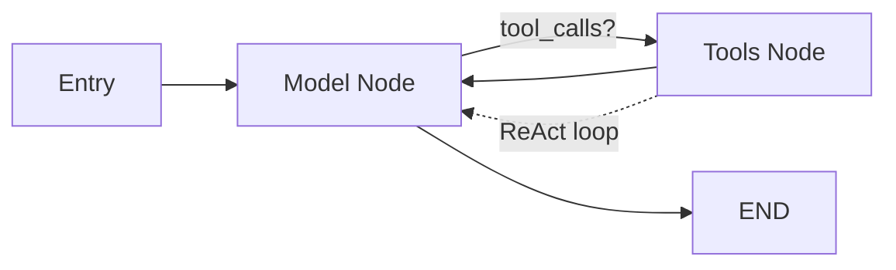
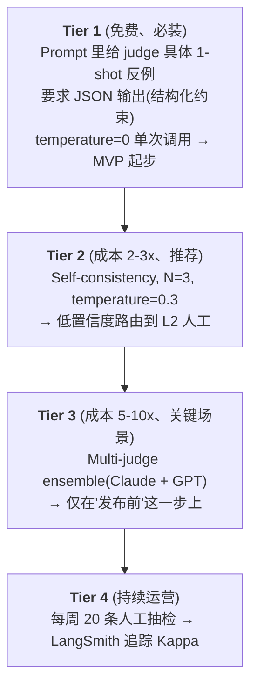
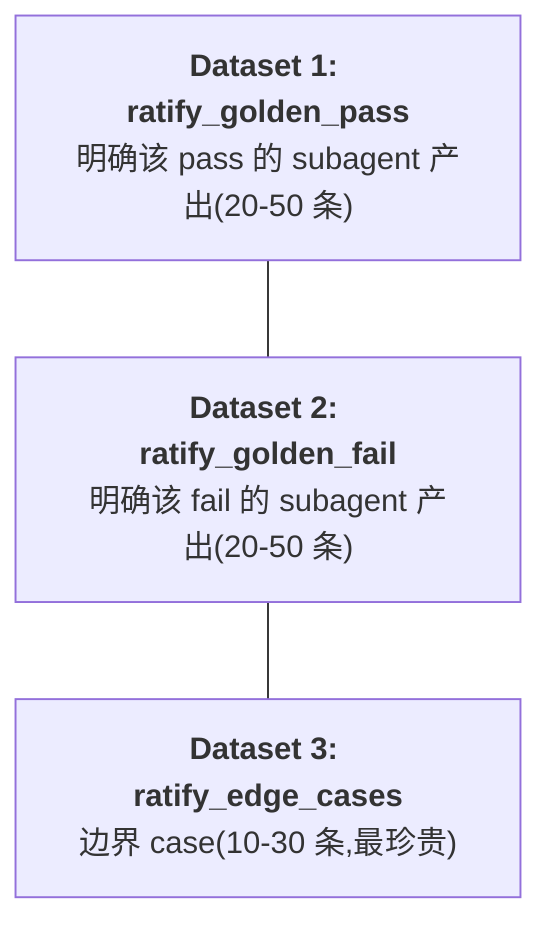
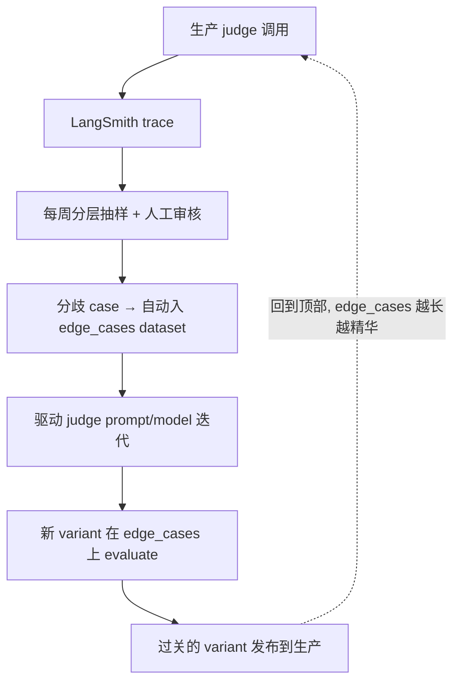
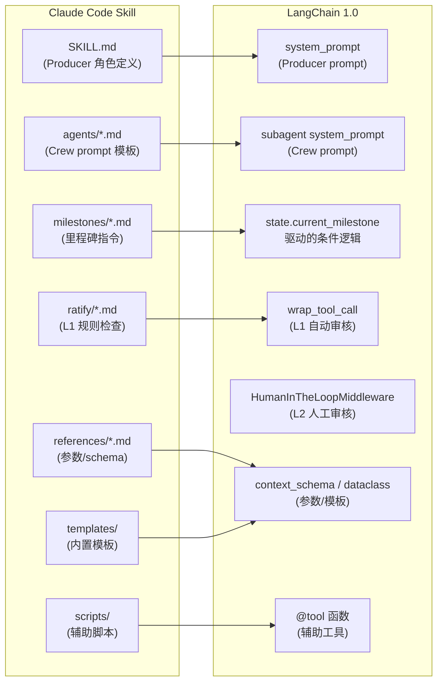

# LangChain 1.0 架构深度探索 Session

**Session 日期**: 2026-04-18 **主题**: LangChain 1.0 架构 → create\_agent → 多 Agent 迁移 → Ratify 机制 → LangSmith 整合 **适用场景**: 短视频自动化生产 pipeline(服装店 \+ 民间故事)

---

## 目录

1. [LangChain 1.0 架构总览](#1-langchain-10-架构总览2025-年-10-月后)
2. [create_agent 深度解析](#2-create_agent-langchain-10-的唯一高层抽象)
3. [多 Agent 迁移实战](#3-把-producer-in-skill-架构翻译成-langchain-10)
4. [Ratify 两层审核机制](#4-ratify-机制的两层落地)
5. [Judge 鲁棒化](#5-judge-会怎么翻车以及怎么治)
6. [LangSmith 整合闭环](#6-把-ratify-系统整合进-langsmith-工作流)
7. [Skill 组件到 LangChain 1.0 的完整映射](#7-skill-组件到-langchain-10-的完整映射)
8. [附录: 关键资产索引](#附录-关键资产索引)

---

## 1\. LangChain 1.0 架构总览(2025 年 10 月后)

### TL;DR

整个生态现在是**三层同心圆**,别再用 2023 年那套 Chains/LCEL 的老地图了:



### 1.0 的三个核心改进

> 官方定义: *"LangChain v1 is a focused, production-ready foundation for building agents."*

**(1) `create_agent` — 新标准** 替代 `langgraph.prebuilt.create_react_agent`,成为构建 Agent 的唯一高层 API。

**(2) `content_blocks` — 标准化消息内容格式** 新增 `content_blocks` 属性,跨 provider 统一访问 reasoning traces、citations、server-side tool calls 等。当前支持: `langchain-anthropic`、`langchain-aws`、`langchain-openai`、`langchain-google-genai`、`langchain-ollama`。

```python
from langchain_anthropic import ChatAnthropic

model = ChatAnthropic(model="claude-sonnet-4-6")
response = model.invoke("What's the capital of France?")

for block in response.content_blocks:
    if block["type"] == "reasoning":
        print(f"Model reasoning: {block['reasoning']}")
    elif block["type"] == "text":
        print(f"Response: {block['text']}")
    elif block["type"] == "tool_call":
        print(f"Tool call: {block['name']}({block['args']})")
```

**(3) 精简命名空间** `langchain` 包只保留 Agent 构建核心:

| 命名空间 | 包含内容 | 来源 |
| :---- | :---- | :---- |
| `langchain.agents` | `create_agent`, `AgentState` | 核心 |
| `langchain.messages` | Message types, `content_blocks`, `trim_messages` | 从 langchain-core 重导出 |
| `langchain.tools` | `@tool`, `BaseTool`, injection helpers | 从 langchain-core 重导出 |
| `langchain.chat_models` | `init_chat_model`, `BaseChatModel` | 统一模型初始化 |
| `langchain.embeddings` | `Embeddings`, `init_embeddings` | Embedding 模型 |

**`langchain-classic`** — 遗留功能迁移至此:

- Legacy chains 和 chain 实现 (LCEL、`AgentExecutor`)
- Retrievers (`MultiQueryRetriever` 等 `langchain.retrievers` 模块)
- Indexing API
- Hub 模块 (程序化 prompt 管理)
- `langchain-community` 导出

```bash
pip install langchain-classic  # 迁移旧代码

# 迁移方式
from langchain_classic import ...          # 替代 from langchain import ...
from langchain_classic.chains import ...   # 替代 from langchain.chains import ...
from langchain_classic.retrievers import ... # 替代 from langchain.retrievers import ...
```

### 三层的分工

| 层级 | 定位 | 使用时机 |
| :---- | :---- | :---- |
| **Deep Agents** | Batteries-included Agent,自带长对话压缩、虚拟文件系统、子 Agent 派生 | 想快速搞个能跑长任务的 Agent |
| **LangChain** | 高层 Agent 抽象 + 模型/工具集成标准化(700+ integrations) | 需要自定义但不想碰底层编排 |
| **LangGraph** | 低层 DAG/状态图运行时,提供 durable execution、streaming、HITL、persistence | 需要确定性 + Agent 混合工作流,重度定制 |

### 统一模型初始化: `init_chat_model`

1.0 新增 `langchain.chat_models.init_chat_model`,一行代码跨 provider 初始化模型:

```python
from langchain.chat_models import init_chat_model

# 字符串自动推断 provider
model = init_chat_model("gpt-5")              # 自动 → openai:gpt-5
model = init_chat_model("claude-sonnet-4-6")  # 自动 → anthropic:claude-sonnet-4-6
model = init_chat_model("gemini-2.5-flash-lite")  # 自动 → google_genai:...

# 也可以显式指定 provider
model = init_chat_model("gpt-5", model_provider="openrouter")
model = init_chat_model("claude-sonnet-4-6", model_provider="bedrock_converse")
```

支持的 provider: `openai`, `anthropic`, `google_genai`, `bedrock_converse`, `azure_openai`, `huggingface`, `openrouter` 等。需要更细粒度控制时(temperature、base_url 等),直接用 provider 包实例化。

### 组件分类

| 类别 | 关键组件 | 典型场景 |
| :---- | :---- | :---- |
| Models | Chat models / LLMs / Embedding models | 推理、生成、语义理解 |
| Tools | APIs、数据库等 | 搜索、取数、计算 |
| Agents | ReAct、tool-calling agents | 非确定性决策流 |
| Memory | Message history、自定义 state | 对话、有状态交互 |
| Retrievers | Vector / web retriever | RAG、知识库 |
| Document Processing | Loaders / Splitters / Transformers | PDF、网页摄取 |
| Vector Stores | Chroma / Pinecone / FAISS | 语义检索 |

---

## 2\. `create_agent`: LangChain 1.0 的唯一高层抽象

### 一句话定位

`create_agent` = **LangGraph StateGraph + ReAct 循环 + Middleware 系统**的封装器。



### 核心签名

```python
from langchain.agents import create_agent

agent = create_agent(
    model,              # str | ChatModel | dynamic via middleware
    tools,              # list[BaseTool | callable] | []
    system_prompt,      # str | SystemMessage | @dynamic_prompt middleware
    response_format,    # Pydantic schema | ToolStrategy | ProviderStrategy
    middleware,         # list[AgentMiddleware] ← 核心扩展点
    state_schema,       # TypedDict extends AgentState(自定义短期记忆)
    context_schema,     # dataclass/TypedDict(运行时只读上下文)
    name,               # 多 Agent 系统作为 subgraph 的节点名
)
```

返回的是标准的 LangGraph `Pregel` 对象 —— `invoke / stream / astream_events / get_state / update_state` 全都能用。

### Middleware: 唯一扩展点

> *"Middleware is the defining feature of create_agent. It offers a highly customizable entry-point, raising the ceiling for what you can build."*

1.0 把所有"高级行为"都统一成 middleware,共 **6 个 hook**:

| Hook | 作用时机 | 典型用途 |
| :---- | :---- | :---- |
| `before_agent` | Agent 调用前 | 加载 memory、验证输入 |
| `before_model` | 每次 LLM 调用前 | 动态拼 prompt、裁剪 messages |
| `wrap_model_call` | 包裹每次 LLM 调用 | 动态选模型、动态过滤工具 |
| `wrap_tool_call` | 包裹每次工具执行 | 错误兜底、重试、rate limit、Ratify 审核 |
| `after_model` | 每次 LLM 响应后 | 验证输出、应用 guardrails |
| `after_agent` | Agent 完成后 | 保存结果、清理 |

完整的类式写法: 继承 `AgentMiddleware`,实现任意 hook,并且 **middleware 本身可以携带自己的 `state_schema` 和 `tools`**。

### 预置 Middleware (官方内置)

| Middleware | 作用 | 示例 |
| :---- | :---- | :---- |
| `PIIMiddleware` | 自动脱敏(邮箱、手机号等) | `PIIMiddleware("email", strategy="redact")` |
| `SummarizationMiddleware` | 对话历史过长时自动压缩 | `SummarizationMiddleware(model="claude-sonnet-4-6", trigger={"tokens": 500})` |
| `HumanInTheLoopMiddleware` | 敏感工具调用前暂停等人工审批 | `HumanInTheLoopMiddleware(interrupt_on={...})` |

```python
from langchain.agents import create_agent
from langchain.agents.middleware import (
    PIIMiddleware, SummarizationMiddleware, HumanInTheLoopMiddleware
)

agent = create_agent(
    model="claude-sonnet-4-6",
    tools=[read_email, send_email],
    middleware=[
        PIIMiddleware("email", strategy="redact", apply_to_input=True),
        PIIMiddleware("phone_number", strategy="block",
            detector=r"(?:\+?\d{1,3}[\s.-]?)?(?:\(?\d{2,4}\)?[\s.-]?)?\d{3,4}[\s.-]?\d{4}"),
        SummarizationMiddleware(model="claude-sonnet-4-6", trigger={"tokens": 500}),
        HumanInTheLoopMiddleware(interrupt_on={
            "send_email": {"allowed_decisions": ["approve", "edit", "reject"]}
        }),
    ],
)
```

### 动态选模型(省钱经典套路)

```python
from langchain_openai import ChatOpenAI
from langchain.agents.middleware import wrap_model_call, ModelRequest, ModelResponse

basic_model = ChatOpenAI(model="gpt-5.4-mini")
advanced_model = ChatOpenAI(model="gpt-5.4")

@wrap_model_call
def route_model(request: ModelRequest, handler) -> ModelResponse:
    model = advanced_model if len(request.state["messages"]) > 10 else basic_model
    return handler(request.override(model=model))
```

### 运行时注册工具(MCP 场景必用)

必须同时实现两个 hook:

- `wrap_model_call` → 把工具塞进 `request.tools`
- `wrap_tool_call` → 告诉 Agent 怎么执行这个"原本不在列表里"的工具

```python
from langchain.tools import tool
from langchain.agents import create_agent
from langchain.agents.middleware import AgentMiddleware, ModelRequest, ToolCallRequest

@tool
def calculate_tip(bill_amount: float, tip_percentage: float = 20.0) -> str:
    """Calculate the tip amount for a bill."""
    tip = bill_amount * (tip_percentage / 100)
    return f"Tip: ${tip:.2f}, Total: ${bill_amount + tip:.2f}"

class DynamicToolMiddleware(AgentMiddleware):
    def wrap_model_call(self, request: ModelRequest, handler):
        updated = request.override(tools=[*request.tools, calculate_tip])
        return handler(updated)

    def wrap_tool_call(self, request: ToolCallRequest, handler):
        if request.tool_call["name"] == "calculate_tip":
            return handler(request.override(tool=calculate_tip))
        return handler(request)

agent = create_agent(
    model="gpt-4o",
    tools=[get_weather],  # 仅注册静态工具
    middleware=[DynamicToolMiddleware()],
)
# Agent 现在可以同时使用 get_weather 和 calculate_tip
```

> **`request.override()`** 是 middleware 修改请求的标准 API,支持 `model=`, `tools=`, `tool=` 等参数。

### 结构化输出

1.0 改进了结构化输出:在**主循环**中生成(不再需要额外 LLM 调用),模型可选择调用工具或使用 provider 原生结构化生成。

```python
from langchain.agents import create_agent
from langchain.agents.structured_output import ToolStrategy
from pydantic import BaseModel

class Weather(BaseModel):
    temperature: float
    condition: str

agent = create_agent(
    "gpt-5.4-mini",
    tools=[weather_tool],
    response_format=ToolStrategy(Weather)
)

result = agent.invoke({"messages": [{"role": "user", "content": "What's the weather in SF?"}]})
print(result["structured_response"])  # Weather(temperature=70.0, condition='sunny')
```

- 传 Pydantic 类 → 1.0 自动选策略(原生支持走 `ProviderStrategy`,否则 fallback `ToolStrategy`)
- `ToolStrategy` 新增 `handle_errors` 参数:控制解析错误和多 tool call 场景
- 结果塞在 `result["structured_response"]`,不污染 messages

### 自定义 State

```python
class CustomState(AgentState):  # 必须继承 AgentState
    user_preferences: dict
```

### 对比 LangGraph 的心智模型

| LangGraph 写法 | `create_agent` 对应 |
| :---- | :---- |
| 手写 `StateGraph` + `ToolNode` + `tools_condition` | 内置 ReAct 循环 |
| `checkpointer=MemorySaver()` | 作为参数传入 |
| 多 Agent 里的 Supervisor 节点 | `name="xxx"` 当 subgraph |
| `pre_model_hook` / `post_model_hook` | `@wrap_model_call` |
| 条件边里手动判断工具调用 | ReAct 循环已内置 |
| Runtime `configurable` | `context_schema` + `runtime.context` |
| `langgraph.store` (跨线程数据) | `store=InMemoryStore()` 参数 |
| Streaming (`stream` / `astream_events`) | 内置,开箱即用 |
| HITL (`interrupt` / `Command(resume=)`) | `HumanInTheLoopMiddleware` |

### Store: 跨线程持久化数据

除了 `state`(线程内短期记忆)和 `context`(运行时只读),1.0 还提供 `store` 用于跨线程持久化数据:

```python
from langgraph.store.memory import InMemoryStore

agent = create_agent(
    model="gpt-5.4",
    tools=[search_tool, analysis_tool],
    middleware=[store_based_tools],
    context_schema=Context,
    store=InMemoryStore()
)

# middleware 中通过 request.runtime.store 访问
feature_flags = store.get(("features",), user_id)
```

### 容易踩的坑

1. **`tools=[]` 合法** —— 退化成单纯 LLM 节点  
2. **动态模型 + 结构化输出冲突** —— 传进 middleware 的模型不能是 pre-bound
3. **Agent 名字别用空格/中文** —— 某些 provider 会拒绝  
4. **`langchain-classic` 救命药** —— 生产上旧 `AgentExecutor` 可继续跑,但 deprecated

---

## 3\. 把 Producer-in-Skill 架构翻译成 LangChain 1.0

### 架构映射

| Claude Code 架构 | LangChain 1.0 对应 |
| :---- | :---- |
| Producer(Claude Code 主控) | **Main agent**(`create_agent`,supervisor) |
| visual-director / sound-engineer 等 subagent | **Subagent**(每个独立 `create_agent`) |
| 通过 built-in Agent tool 派发 | **Subagent-as-tool** 模式 |
| `state.yaml` per-milestone 状态 | **Custom `AgentState`** + `checkpointer` |
| 并行执行 visual + sound | **Main agent 一个 turn 内发多个 tool_call** |
| 两层 ratify 系统 | **Middleware `wrap_tool_call`** + `interrupt` |
| Agent prompt `.md` 文件 | **`system_prompt` 参数** |

### 两种多 Agent 模式对比

官方教程提供了两种模式,各有适用场景:

**模式 A: Individual Tool Wrappers (官方推荐)**

每个 subagent 封装成独立的 tool,Supervisor 看到的是高层工具:

```python
@tool
def schedule_event(request: str) -> str:
    """Schedule calendar events using natural language."""
    result = calendar_agent.invoke({"messages": [{"role": "user", "content": request}]})
    return result["messages"][-1].text

@tool
def manage_email(request: str) -> str:
    """Send emails using natural language."""
    result = email_agent.invoke({"messages": [{"role": "user", "content": request}]})
    return result["messages"][-1].text

supervisor = create_agent(model, tools=[schedule_event, manage_email], ...)
```

优势: 每个工具描述清晰,Supervisor 路由决策在领域层面而非 API 层面;返回 subagent 最终响应,不暴露中间推理。

**模式 B: Single Dispatch Tool (本项目使用)**

一个 `task(agent_name, description)` 工具统一派发:

```python
@tool
def task(agent_name: AgentName, description: str, ...) -> Command:
    """派发任务给专业 subagent。"""
    agent = SUBAGENTS[agent_name.value]
    result = agent.invoke({"messages": [{"role": "user", "content": description}]})
    ...
```

优势: subagent 角色对等、新增简单;正好适合 video-maker 场景。

| 对比维度 | Individual Wrappers | Single Dispatch |
| :---- | :---- | :---- |
| 路由粒度 | 领域层面(语义化工具名) | 枚举选择(固定 agent 列表) |
| 新增 subagent | 加 tool + 函数 | 改 Enum + dict |
| 工具描述质量 | 高(每个 tool 描述独立) | 低(一个通用 description) |
| 适合场景 | subagent 职责差异大 | subagent 角色对等 |

### 5 个设计决策(短视频场景直接给答案)

**① Tool per agent vs Single dispatch tool → 选 Single dispatch tool** subagent 角色对等、能独立开发、将来会加新的 → 正好是 single dispatch 甜蜜点。

**② Sync vs Async → 混合,主路径 sync + 渲染 async** 视频渲染(剪映导出)长任务该 async;脚本生成、配音、画面指令生成 sync。

**③ 并行 → 天然支持** Main agent 一次生成多个 tool_call,框架并行。**不需要像 LangGraph 那样手写 `Send` API**。

**④ State 传递 → `runtime.state` 注入 + `Command` 回传** `state.yaml` milestone 机制翻译:

- 自定义 `AgentState` 加字段  
- Subagent 通过 `ToolRuntime[None, State]` 读 state
- Subagent 返回 `Command(update={...})` 更新 state

### 核心骨架代码

```python
from typing import Annotated, Literal
from enum import Enum
from langchain.agents import create_agent, AgentState
from langchain.tools import tool, ToolRuntime, InjectedToolCallId
from langchain.messages import ToolMessage
from langgraph.types import Command
from langgraph.checkpoint.memory import InMemorySaver

# ---------- 1. 共享 State (对应 state.yaml) ----------
class VideoProductionState(AgentState):
    current_milestone: str  # "script" / "visual" / "audio" / "render"
    approved_script: str | None
    storyboard: list[dict] | None
    bgm_url: str | None
    render_job_id: str | None

# ---------- 2. 各个 subagent ----------
script_writer = create_agent(
    model="anthropic:claude-sonnet-4-6",
    tools=[search_trending_topics, ...],
    system_prompt="你是短视频脚本专家。输出必须包含:钩子、冲突、转折、CTA。",
    name="script_writer",
)

visual_director = create_agent(
    model="anthropic:claude-sonnet-4-6",
    tools=[generate_storyboard, pick_shot_type, ...],
    system_prompt="你是视觉导演。基于脚本生成分镜和运镜指令...",
    name="visual_director",
)

sound_engineer = create_agent(
    model="anthropic:claude-sonnet-4-6",
    tools=[pick_bgm, generate_voiceover, ...],
    system_prompt="你是声音工程师。基于脚本选 BGM 和生成配音...",
    name="sound_engineer",
)

SUBAGENTS = {
    "script_writer": script_writer,
    "visual_director": visual_director,
    "sound_engineer": sound_engineer,
}

class AgentName(str, Enum):
    SCRIPT = "script_writer"
    VISUAL = "visual_director"
    SOUND = "sound_engineer"

# ---------- 3. 单一派发工具 ----------
@tool
def task(
    agent_name: AgentName,
    description: str,
    tool_call_id: Annotated[str, InjectedToolCallId],
    runtime: ToolRuntime[None, VideoProductionState],
) -> Command:
    """派发任务给专业 subagent。"""
    agent = SUBAGENTS[agent_name.value]
    result = agent.invoke({
        "messages": [{"role": "user", "content": description}],
        "approved_script": runtime.state.get("approved_script"),
        "current_milestone": runtime.state.get("current_milestone", "script"),
    })

    updates = {
        "messages": [ToolMessage(
            content=result["messages"][-1].content,
            tool_call_id=tool_call_id,
        )]
    }
    for key in ("storyboard", "bgm_url", "approved_script"):
        if key in result and result[key]:
            updates[key] = result[key]

    return Command(update=updates)

# ---------- 4. 异步渲染工具 ----------
@tool
def start_render(storyboard: dict) -> dict:
    """启动剪映渲染任务,立刻返回 job_id。"""
    job_id = jianying_api.submit(storyboard)
    return {"job_id": job_id, "status": "running"}

@tool
def check_render_status(job_id: str) -> str: ...

@tool
def get_render_result(job_id: str) -> str: ...

# ---------- 5. Producer (main agent) ----------
producer = create_agent(
    model="anthropic:claude-sonnet-4-6",
    tools=[task, start_render, check_render_status, get_render_result],
    system_prompt="""你是短视频 Producer。按 milestone 推进:
    1. script → 调用 script_writer
    2. visual + audio → 并行调用 visual_director 和 sound_engineer
    3. render → start_render(异步),告诉用户 job_id

    可用 subagent:
    - script_writer: 脚本
    - visual_director: 分镜
    - sound_engineer: 音频

    用 task 工具派发。重要决策前先跟用户确认。""",
    state_schema=VideoProductionState,
    checkpointer=InMemorySaver(),
    name="video_producer",
)
```

### 注意事项

**① 并行 tool_call 不需要写 Send** 只要在 system_prompt 明确告诉 main agent "可以一次响应里同时发多个 tool_call",provider 原生并行执行。

**② Subagents 模式 token 消耗会翻倍** 重复请求场景下每次 subagent 都是 stateless 冷启动。

- 服装店:**每条视频独立任务**,stateless 是优点  
- 民间故事连载:**保持系列感** → subagent 编译时传 `checkpointer=True`(continuations mode)

---

## 4\. Ratify 机制的两层落地

### 两层各自解决什么问题

| 层级 | 解决什么 | 特征 | 对应机制 |
| :---- | :---- | :---- | :---- |
| **L1 自动审核** | 快速过滤 subagent 明显不合格输出 | 同步、毫秒~秒级、无人工 | `@wrap_tool_call` + LLM judge |
| **L2 人工审核** | 关键 milestone 决策放行 | 可能等数小时,需持久化状态 | `HumanInTheLoopMiddleware` + checkpointer |

### L1: 自动审核 —— `@wrap_tool_call` + LLM judge

```python
from langchain.agents.middleware import wrap_tool_call
from langchain.messages import ToolMessage
from langchain_anthropic import ChatAnthropic

judge = ChatAnthropic(model="claude-haiku-4-5", temperature=0)

RATIFY_PROMPT = """你是短视频内容审核员。评估以下 subagent 产出:

【任务】{task}

【产出】{output}

按以下维度评分(1-5):
- 格式完整度
- 内容深度
- 平台合规

只输出 JSON: {{"pass": true/false, "score": 1-5, "reason": "..."}}"""

MAX_RETRY = 2

@wrap_tool_call
def l1_auto_ratify(request, handler):
    """Subagent 产出的自动审核 + 自动重试。"""
    if request.tool_call["name"] != "task":
        return handler(request)

    attempt = 0
    last_feedback = ""
    while attempt < MAX_RETRY:
        if last_feedback:
            request.tool_call["args"]["description"] += f"\n\n[上次审核反馈]: {last_feedback}"

        result = handler(request)
        output_content = result.content if hasattr(result, "content") else str(result)

        verdict = judge.invoke([{
            "role": "user",
            "content": RATIFY_PROMPT.format(
                task=request.tool_call["args"]["description"],
                output=output_content,
            )
        }])
        import json
        v = json.loads(verdict.content)

        if v["pass"]:
            return result

        last_feedback = v["reason"]
        attempt += 1

    return ToolMessage(
        content=f"[L1 审核未通过,已重试 {MAX_RETRY} 次] 最后反馈: {last_feedback}",
        tool_call_id=request.tool_call["id"],
    )
```

**设计要点:**

- Judge 用便宜模型(Haiku / gpt-4.1-mini)  
- Retry 时注入反馈是核心 —— 不然 subagent 冷启动产出永远一样  
- Retry 用尽不抛异常,把失败原因写回 ToolMessage,让 main agent 决定

### L2: 人工审核 —— `HumanInTheLoopMiddleware`

```python
from langchain.agents.middleware import HumanInTheLoopMiddleware
from langgraph.checkpoint.postgres import PostgresSaver

producer = create_agent(
    model="anthropic:claude-sonnet-4-6",
    tools=[task, publish_final_video, start_render, ...],
    middleware=[
        l1_auto_ratify,  # L1 在前
        HumanInTheLoopMiddleware(  # L2 在后
            interrupt_on={
                "publish_final_video": {
                    "allowed_decisions": ["approve", "edit", "reject"],
                },
                "start_render": {
                    "allowed_decisions": ["approve", "reject"],
                },
                "task": False,
                "search_trending_topics": False,
            },
            description_prefix="⚠️ 需要 Gary 审核",
        ),
    ],
    state_schema=VideoProductionState,
    checkpointer=PostgresSaver.from_conn_string("postgresql://..."),
)
```

**使用流程(注意 `version="v2"`):**

```python
config = {"configurable": {"thread_id": "video_20260418_01"}}

result = producer.invoke(
    {"messages": [...]},
    config=config,
    version="v2",
)

if result.interrupts:
    for action in result.interrupts[0].value["action_requests"]:
        print(f"待审: {action['name']}")
        print(f"参数: {action['arguments']}")

# Resume
from langgraph.types import Command

producer.invoke(
    Command(resume={"decisions": [
        {"type": "edit", "edited_action": {
            "name": "publish_final_video",
            "args": {"title": "改过的标题"}
        }}
    ]}),
    config=config,
    version="v2",
)
```

### 容易踩的坑

**① Checkpointer 必须持久化** —— `InMemorySaver` 只适合 demo,生产用 `PostgresSaver` 或 `SqliteSaver` **② L1 和 L2 顺序** —— middleware 数组里 L1 在前、L2 在后

### 动态审核强度

```python
class VideoProductionState(AgentState):
    ratify_level: Literal["strict", "normal", "fast"]

@wrap_tool_call
def l1_auto_ratify(request, handler):
    level = request.state.get("ratify_level", "normal")
    if level == "fast":
        return handler(request)  # 跳过 L1
    ...
```

---

## 5\. Judge 会怎么翻车,以及怎么治

### Judge 的三种翻车模式

| 翻车模式 | 症状 | 根因 |
| :---- | :---- | :---- |
| **方差型** | 同一输入跑三次,一次 pass 两次 fail | 温度、采样随机性、prompt 模糊 |
| **偏差型** | 系统性偏爱某种答案 | LLM 预训练偏好 |
| **漂移型** | 跟人工评审一致率随时间下降 | 被审内容分布变化 |
| **规格泄漏型** | Judge 把无关维度纳入评分 | Prompt 工程不够 |

### 治方差: Self-consistency(多次采样投票)

```python
from collections import Counter
import asyncio

async def robust_ratify(judge, prompt: str, n_samples: int = 3) -> dict:
    tasks = [
        judge.ainvoke([{"role": "user", "content": prompt}])
        for _ in range(n_samples)
    ]
    results = await asyncio.gather(*tasks)

    verdicts = [json.loads(r.content) for r in results]
    votes = Counter(v["pass"] for v in verdicts)
    pass_rate = votes[True] / n_samples

    final_pass = pass_rate >= 2/3  # 比简单多数严格

    return {
        "pass": final_pass,
        "confidence": pass_rate,
        "reasons": [v["reason"] for v in verdicts],
    }
```

**关键:**

- `temperature` 必须 \> 0(推荐 0.3-0.5)  
- N 选 3 或 5,奇数避免平票  
- `confidence` 字段是黄金 —— 低置信度路由到人工

### 治偏差: Multi-judge ensemble

```python
from langchain_anthropic import ChatAnthropic
from langchain_openai import ChatOpenAI

judges = [
    ChatAnthropic(model="claude-haiku-4-5", temperature=0.3),
    ChatOpenAI(model="gpt-4.1-mini", temperature=0.3),
]

async def ensemble_ratify(prompt: str) -> dict:
    tasks = [j.ainvoke([{"role": "user", "content": prompt}]) for j in judges]
    results = await asyncio.gather(*tasks, return_exceptions=True)

    verdicts = []
    for r in results:
        if isinstance(r, Exception):
            continue
        verdicts.append(json.loads(r.content))

    if not verdicts:
        return {"pass": False, "reason": "judges unavailable", "degraded": True}

    pass_rate = sum(1 for v in verdicts if v["pass"]) / len(verdicts)
    return {"pass": pass_rate >= 2/3, "confidence": pass_rate}
```

### 治偏差进阶: Pairwise 比较

**LLMs are better discriminators than evaluators** —— 做比较比做打分准得多。

PAIRWISE_PROMPT = """比较两个视频脚本,哪个更适合服装店推广?

脚本 A(历史爆款基准):
{baseline}

脚本 B(新产出):
{candidate}

只回答: A/B/Tie,并说明核心差异(1 句)。
格式: {{"winner": "A|B|Tie", "reason": "..."}}"""

**优势:**

- LLM 做比较比打分准(学术反复验证)  
- 绝对分数会随模型情绪漂移,相对比较更稳定  
- 避免"分数膨胀"

**代价:** 需要维护 baseline 库(从已发视频里挑 3-5 条爆款)。

### 治漂移: 人工抽检校准

**关键指标是 Cohen's Kappa 而不是准确率** —— Kappa 扣除了"瞎猜的运气成分"。

```python
def calibrate_judge():
    samples = langsmith_client.list_runs(filter="...", limit=100)
    audit_batch = random.sample(samples, 20)

    # 你手动打标
    human_labels = [...]
    judge_labels = [s.outputs["pass"] for s in audit_batch]
    kappa = cohen_kappa(human_labels, judge_labels)

    if kappa < 0.6:
        alert("Judge drift detected")
```

### 务实组合拳(对服装店场景)



### 分级 ratify 的代码结构

```python
@wrap_tool_call
async def tiered_ratify(request, handler):
    if request.tool_call["name"] != "task":
        return handler(request)

    result = handler(request)
    milestone = request.state.get("current_milestone")

    if milestone in ("script", "storyboard"):
        verdict = await robust_ratify(cheap_judge, prompt, n_samples=3)
    elif milestone == "final_publish":
        verdict = await ensemble_ratify(prompt)
    else:
        verdict = await simple_ratify(cheap_judge, prompt)

    # 低置信度 → 主动降级为人工
    if 0.34 < verdict["confidence"] < 0.67:
        return ToolMessage(
            content=f"[LOW_CONFIDENCE] judges split: {verdict['reasons']}",
            tool_call_id=request.tool_call["id"],
        )

    return result if verdict["pass"] else retry_with_feedback(...)
```

**精髓: Judge 不确定时,主动把决策权交给 L2 人工** —— 这正是两层 ratify 架构的闭环。

---

## 6\. 把 Ratify 系统整合进 LangSmith 工作流

### 核心心智: LangSmith 当三件事用

| 维度 | 解决什么 | LangSmith 概念 |
| :---- | :---- | :---- |
| Observability | Judge 生产怎么判的、多快、多贵 | **Traces + Metadata** |
| Evaluation | 改 judge prompt 后性能变好坏 | **Datasets + Experiments** |
| Calibration | Judge 和 Gary 的一致率、是否漂移 | **Feedback + Dataset 派生** |

### 第一维度: Trace Metadata 设计

```python
from langsmith import tracing_context

with tracing_context(
    tags=[
        "ratify:enabled",
        f"pipeline:{pipeline_type}",
        f"milestone:{milestone}",
    ],
    metadata={
        # 业务维度
        "project_id": "video_20260418_01",
        "pipeline_type": pipeline_type,
        "milestone": milestone,

        # Ratify 配置维度(关键!A/B 实验靠这个过滤)
        "ratify_tier": "self_consistency",
        "judge_model": "claude-haiku-4-5",
        "judge_temperature": 0.3,
        "judge_n_samples": 3,
        "judge_prompt_version": "v2.1",  # 极其重要

        # Subagent 维度
        "subagent_name": subagent_name,
        "subagent_model": "claude-sonnet-4-6",
    },
):
    result = producer.invoke(...)
```

**给 judge 单独打 metadata + feedback:**

```python
@wrap_tool_call
async def l1_ratify(request, handler):
    if request.tool_call["name"] != "task":
        return handler(request)

    result = handler(request)

    with tracing_context(
        tags=["judge_call", "l1_auto"],
        metadata={
            "judge_role": "l1_auto",
            "subagent_name": request.tool_call["args"]["agent_name"],
            "attempt": request.state.get("ratify_attempt", 0),
        },
    ):
        verdict = await judge.ainvoke(...)

    rt = ls.get_current_run_tree()
    client.create_feedback(
        key="judge_pass",
        score=1 if verdict["pass"] else 0,
        value=verdict["confidence"],
        trace_id=rt.trace_id,
        comment=verdict["reason"],
    )

    return result
```

**设计原则:**

- `tags` 是粗粒度过滤器  
- `metadata` 是细粒度查询器  
- `judge_prompt_version` 必须打

### 第二维度: Dataset 的"三池"结构



**为什么三池:** 单一 dataset 混在一起,accuracy 会被容易 case 稀释。分开跑能精准看到:

- Golden pass 上 judge 召回率  
- Golden fail 上 judge 精确率  
- Edge cases 上 judge 稳定性

**Example 结构:**

```python
client.create_example(
    dataset_id=dataset.id,
    inputs={
        "task": "为红色连衣裙生成服装店视频脚本",
        "output": "【脚本全文...】",
        "milestone": "script",
    },
    outputs={
        "should_pass": False,
        "reason": "开头钩子太弱",
        "severity": "medium",
    },
    metadata={
        "source": "production_override",  # 重要
        "original_judge_verdict": True,
        "override_date": "2026-04-15",
        "reviewer": "gary",
    },
)
```

### 第三维度: Experiment A/B 设计

```python
from langsmith.evaluation import evaluate

def judge_variant_v2_1(inputs: dict) -> dict:
    verdict = run_judge(
        task=inputs["task"],
        output=inputs["output"],
        model="claude-haiku-4-5",
        temperature=0.3,
        n_samples=3,
        prompt_version="v2.1",
    )
    return {"should_pass": verdict["pass"], "confidence": verdict["confidence"]}

def judge_accuracy_evaluator(run, example) -> dict:
    predicted = run.outputs["should_pass"]
    actual = example.outputs["should_pass"]
    return {"key": "judge_accuracy", "score": 1 if predicted == actual else 0}

def judge_miss_evaluator(run, example) -> dict:
    """漏杀 = 坏内容被 judge 放过(严重问题)。"""
    predicted = run.outputs["should_pass"]
    actual = example.outputs["should_pass"]
    is_miss = (predicted == True and actual == False)
    return {"key": "judge_miss", "score": 1 if is_miss else 0}

results = evaluate(
    judge_variant_v2_1,
    data="ratify_edge_cases",
    evaluators=[judge_accuracy_evaluator, judge_miss_evaluator],
    experiment_prefix="judge_v2.1_haiku_nSamples3",
    metadata={
        "judge_prompt_version": "v2.1",
        "judge_model": "claude-haiku-4-5",
        "n_samples": 3,
    },
    num_repetitions=3,
)
```

**关键实验问题:**

| 实验问题 | 变量 | 固定 |
| :---- | :---- | :---- |
| 新版 prompt 更准吗? | `prompt_version` | model、n_samples、dataset |
| 换 GPT-4.1-mini 更好吗? | `judge_model` | prompt、n_samples、dataset |
| n_samples=5 比 3 值吗? | `n_samples` | prompt、model、dataset |
| Ensemble 比单 judge 好多少? | `judge_tier` | prompt set、dataset |

### 第四件事: Calibration Loop 闭环

```python
def weekly_calibration():
    # 1. 拉一周 judge 调用
    runs = client.list_runs(
        project_name="video_production",
        filter='and(eq(tags, "judge_call"), eq(metadata.judge_role, "l1_auto"))',
        start_time=datetime.now() - timedelta(days=7),
        limit=500,
    )
    runs = list(runs)

    # 2. 分层抽样
    high_pass = [r for r in runs if r.outputs.get("confidence", 0) >= 0.8 and r.outputs["should_pass"]]
    high_fail = [r for r in runs if r.outputs.get("confidence", 0) >= 0.8 and not r.outputs["should_pass"]]
    low_conf = [r for r in runs if 0.34 < r.outputs.get("confidence", 0) < 0.67]

    audit_batch = (
        random.sample(high_pass, min(5, len(high_pass))) +
        random.sample(high_fail, min(5, len(high_fail))) +
        low_conf
    )

    # 3. 人工打标,写回 feedback
    for run in audit_batch:
        client.create_feedback(
            run_id=run.id,
            key="human_ground_truth",
            score=1 if human_verdict else 0,
            comment=human_reason,
        )

    # 4. 计算 Kappa
    kappa = cohen_kappa(judge_labels, human_labels)

    # 5. 分歧 case 自动入 edge_cases dataset
    for run, human_label in disagreements:
        client.create_example(
            dataset_name="ratify_edge_cases",
            inputs=run.inputs,
            outputs={"should_pass": human_label, "reason": "..."},
            metadata={
                "source": "calibration_week_" + datetime.now().strftime("%Y%W"),
                "original_judge_verdict": run.outputs["should_pass"],
                "original_confidence": run.outputs["confidence"],
            },
        )

    # 6. 警报
    if kappa < 0.6:
        send_alert(f"Judge drift: kappa={kappa}")

    return kappa
```

### 自愈机制(整个生态的魂)



### 架构级信息流

```mermaid
flowchart TD
    subgraph Prod["生产环境 (Producer Agent)"]
        subgraph Pipeline[""]
            S["Subagent 产出"] --> L1["L1 judge"] --> L2["L2 HITL"]
            S --- M1["metadata"]
            L1 --- M2["feedback"]
            L2 --- M3["feedback"]
        end
    end

    M1 --> LS["<b>LangSmith Observability</b><br>(traces + tags + metadata + fb)"]
    M2 --> LS
    M3 --> LS

    LS --> CAL["每周 Calibration<br>(分层抽样审核)"]
    LS --> AB["A/B Experiments<br>(在 dataset 上测)"]

    CAL --> DS["<b>三个核心 Dataset (真相源)</b><br>golden_pass | golden_fail | edge_cases"]
    AB --> DS

    DS -.->|"新 case 持续补入"| DS
```

### 立刻能做的三件事

**① 给现有 judge 调用打 metadata(1 小时)** 先把 `judge_prompt_version` 和 `judge_model` 打上。

**② 复用现有 article-to-video-script 评测集(半天)** fork 成 `ratify_golden_fail` 或 `ratify_edge_cases`。

**③ 搭最简 calibration loop(1-2 天)** 先不搞花哨界面,脚本每周跑一次,20 条样本扔到笔记手动打标。跑三周知道 judge 稳不稳。

---

## 7. Skill 组件到 LangChain 1.0 的完整映射

> 原始 skill 路径: `E:/workspace/orchestrator_skills/.claude/skills/video-maker/`

### Skill 目录结构与对应关系



### Skill 核心组件逐一翻译

| Skill 组件 | 文件 | LangChain 1.0 对应 | 状态 |
| :---- | :---- | :---- | :---- |
| **Producer 角色** | `SKILL.md` | `create_agent(system_prompt=..., tools=[task])` | 已实现 |
| **Researcher** | `agents/researcher.md` | `create_agent(system_prompt=..., name="researcher")` | 已实现 |
| **Scriptwriter** | `agents/scriptwriter.md` | `create_agent(system_prompt=..., name="scriptwriter")` | 已实现 |
| **Evaluator** | `agents/evaluator.md` | `create_agent(system_prompt=..., name="evaluator")` | 已实现 |
| **Editor** | `agents/editor.md` | 待实现 (visual milestone) | 未实现 |
| **Scene generators** | `agents/scene-batch-*.md` | 待实现 (assets milestone) | 未实现 |
| **L1 Ratify: research** | `ratify/research-rules.md` | `middleware/ratify_l1.py: check_research()` | 已实现 |
| **L1 Ratify: script** | `ratify/script-rules.md` | `middleware/ratify_l1.py: check_script()` | 已实现 |
| **L1 Ratify: assets** | `ratify/assets-rules.md` | 待实现 | 未实现 |
| **L1 Ratify: assembly** | `ratify/assembly-rules.md` | 待实现 | 未实现 |
| **L2 Reviewer** | `agents/reviewer.md` | `HumanInTheLoopMiddleware` | 代码已有,待集成 |
| **GAN Evaluator** | `agents/evaluator.md` + script 里程碑 | `evaluator` subagent + 合约循环 | 已实现 |
| **Pipeline YAML** | `milestones/_pipeline.yaml` | Producer `system_prompt` 内置里程碑序列 | 已实现 |
| **State 管理** | `state.yaml` per thread | `AgentState` + `checkpointer` | 已实现 |
| **参数收集** | SKILL.md §1 (AskUserQuestion) | `ainvoke()` + CLI `--topic/--duration` 参数 | 已实现 |
| **参数派生** | `references/parameters.md` | `main.py: derive_parameters()` | 已实现 |
| **Manifest** | `references/manifest-schema.md` | `state["manifest"]` 字段 | 未实现 |
| **Quality scoring** | `references/quality-scoring.md` | evaluator subagent 加权评分 | 已实现 |

### Skill 中 Agent Prompt 的翻译要点

原始 skill 中每个 `.md` 文件使用 `{variable}` 占位符,由 Producer 渲染后传给 subagent:

```python
# Claude Code Skill 的做法 (Producer 内联渲染)
prompt = open("agents/researcher.md").read()
prompt = prompt.format(duration="1-3min", style="professional", topic="AI Agent")
Agent("researcher").invoke(prompt)

# LangChain 1.0 的做法 (system_prompt 参数)
researcher = create_agent(
    model="deepseek-chat",
    tools=[web_search, ...],
    system_prompt=open("agents/researcher.md").read(),
    # 变量通过 description 参数注入,或用 @dynamic_prompt middleware 动态渲染
)
```

**两种方案**:

1. **静态注入** (当前实现): 变量直接拼进 `task()` 的 `description` 参数,subagent 的 `system_prompt` 保留模板变量不渲染
2. **动态渲染** (更灵活): 用 `@dynamic_prompt` / `before_model` middleware 在运行时读取 `.md` 文件并渲染变量

```python
# 动态渲染方案
@wrap_model_call
def render_agent_prompt(request: ModelRequest, handler) -> ModelResponse:
    if request.state.get("current_milestone") == "research":
        template = open("agents/researcher.md").read()
        rendered = template.format(
            duration=request.state["goal"]["duration"],
            style=request.state["goal"]["style"],
            topic=request.state["goal"]["topic"],
        )
        # 注入到 messages 前面
        request = request.override(messages=[
            {"role": "system", "content": rendered},
            *request.state["messages"]
        ])
    return handler(request)
```

### Ratify 规则文件的翻译对照

| Ratify 规则 (Skill `.md`) | 翻译为 Python 检查 (L1 middleware) |
| :---- | :---- |
| `script.md 存在` | `os.path.exists(output_dir / "script.md")` |
| `scene 数量在目标范围内` | `min_scenes <= scene_count <= max_scenes` |
| `无 3+ 连续同类型 scene` | 连续遍历检查 |
| `每个 scene 有 scene_intent:` | regex `r"^scene_intent:"` 逐行检查 |
| `data_card 有 data_semantic:` | regex `r"^data_semantic:"` + `items` 非空 |
| `禁止 layer_hint:` | `r"^layer_hint:" not in content` |
| `禁止 beats:` | `r"^beats:" not in content` |

### Milestone 指令的加载模式

Skill 设计中里程碑指令是**按需加载**的 (`执行时才 Read`),对应 LangChain 的两种实现:

```python
# 方案 A: 全写进 system_prompt (当前,适合 milestone 少的场景)
system_prompt = """
你是短视频 Producer。按 milestone 推进:
1. research → 调用 researcher
2. script → 调用 scriptwriter
3. visual + audio → 并行调用 visual_director 和 sound_engineer
...
"""

# 方案 B: 里程碑指令动态加载 (适合 milestone 多的场景)
MILESTONE_INSTRUCTIONS = {
    "research": open("milestones/research.md").read(),
    "script": open("milestones/script.md").read(),
    "assets": open("milestones/assets.md").read(),
}

@wrap_model_call
def inject_milestone_instruction(request: ModelRequest, handler) -> ModelResponse:
    milestone = request.state.get("current_milestone")
    if milestone in MILESTONE_INSTRUCTIONS:
        instruction = MILESTONE_INSTRUCTIONS[milestone]
        messages = [{"role": "system", "content": instruction}, *request.state["messages"]]
        request = request.override(messages=messages)
    return handler(request)
```

### 未迁移的 Skill 组件清单

以下组件尚在 Skill 中使用,未翻译为 LangChain:

| 组件 | 用途 | 优先级 | 说明 |
| :---- | :---- | :---- | :---- |
| **Editor** | 视觉风格控制、分镜细化 | P1 | visual milestone 核心 |
| **Scene Batch Generator** | 批量图片/视频生成 | P1 | assets milestone 核心 |
| **Scene Patch Generator** | 单场景修补 | P2 | 容错能力 |
| **TTS/Whisper Pipeline** | 配音生成+字幕对齐 | P2 | 已有 CLI 封装 |
| **BGM/SFX 选择** | 背景音乐/音效 | P2 | 已有 CLI 封装 |
| **Remotion 渲染** | 视频合成 | P1 | 已有 Remotion 项目 |
| **Manifest 管理** | 逐场景元数据 | P3 | 可简化为 state 字段 |
| **Quality Report** | 评分报告生成 | P3 | evaluator 输出即可 |
| **L2 Reviewer Agent** | 人工审核 agent | P2 | HumanInTheLoopMiddleware |

---

## 附录: 关键资产索引

### 已有资产(对话中提到)

- **article-to-video-script skill**(2026-02 创建) —— 在 Claude 沙箱里产出,.skill 文件在 `/mnt/user-data/outputs/`(沙箱已销毁,需检查本地 Downloads 或重建)  
- **服装推广文案工坊 Project** —— Claude Project,与 skill 不是同一个东西  
- **LangSmith 评测集** `article-to-video-script-eval-v1` —— 5 维评测,GPT-4o 当 judge  
- **ARCHITECTURE-VIDEO-MAKER.md** —— 现有 Claude Code skill 完整架构文档(Producer-Crew 模式)

### 关键技术栈

- **LangChain 1.0**(2025-10-20 发布)  
- **LangGraph**(底层运行时)  
- **LangSmith**(观测 + 评测)
- **pyJianYingDraft**(剪映草稿自动生成)  
- **Remotion**(video-maker 的视频渲染引擎)

### 官方文档引用路径

- **LangChain v1 发布说明**: `/oss/python/releases/langchain-v1.mdx`
- **Agents 完整文档**: `/oss/python/langchain/agents.mdx`
- **多 Agent Supervisor 模式**: `/oss/python/langchain/multi-agent/subagents-personal-assistant.mdx`
- **Middleware 深度指南**: `/oss/python/langchain/middleware/built-in.mdx`
- **HITL (Human-in-the-Loop)**: `/oss/python/langgraph/interrupts.mdx`
- **LangSmith metadata**: `/langsmith/add-metadata-tags.mdx`
- **LangSmith feedback**: `/langsmith/attach-user-feedback.mdx`
- **LangSmith 自定义 checkpointer**: `/langsmith/custom-checkpointer.mdx`
- **LangSmith evaluate**: `/langsmith/evaluate-with-opentelemetry.mdx`
- **Migration guide**: (参见 v1 发布页 "Migration guide" 链接)

### 未展开的方向(可后续探索)

- Constitutional AI 风格的 judge(先生成 rubric 再打分)
- Judge 的元评测(Haiku vs GPT-4.1-mini 谁更像你)
- Ratify 系统的成本模型
- LangSmith UI 搭 ratify 专属 dashboard
- 持久化选型: PostgresSaver vs SqliteSaver vs Redis
- `content_blocks` 跨 provider 的 reasoning/citation 处理
- `Store` 用于 subagent 间的跨线程知识共享(如爆款脚本库)

### Session 的中断点

最后一个未回答的问题: **用 langchain 搭建 video-maker skill \+ 完整评估系统**(上传了 ARCHITECTURE-VIDEO-MAKER.md,但因转为保存 session 未展开)。

---

**文档生成时间**: 2026-04-18
**审阅更新**: 2026-04-21 — 基于 LangChain 官方文档 (docs.langchain.com) 校验并补充:
- 补全 Middleware 6 个 hook (原 3 个) + 预置中间件 (PII / Summarization / HITL)
- 新增 `content_blocks` 标准化消息内容格式
- 新增 `init_chat_model` 统一模型初始化 API
- 新增 `Store` 跨线程持久化数据
- 新增 `langchain-classic` 遗留功能完整清单
- 更新结构化输出 (`ToolStrategy.handle_errors`)
- 新增两种多 Agent 模式对比 (Individual Wrappers vs Single Dispatch)
- 更新 `request.override()` middleware 标准 API

**后续如需继续**: 从"用 LangChain 搭建 video-maker"这个实战题展开,将本文档所有理论落地到具体代码。
